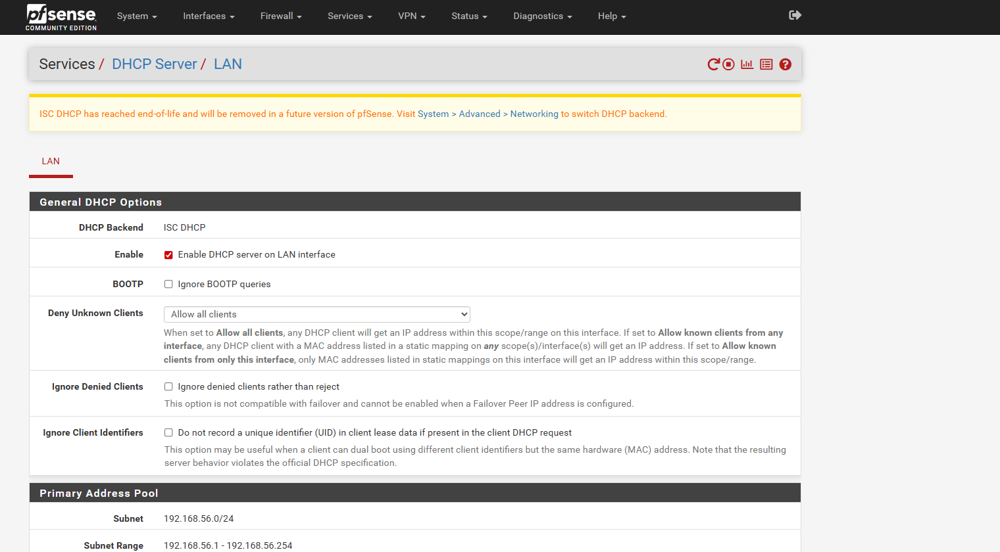

### 🏗️ Home Lab Setup History

1. 💻 Created a new VirtualBox VM  
   Installed the latest Ubuntu Server 22.04 distro.

2. 🛠️ Installed essential programs on the VM  
   - OpenSSH Server (to enable SSH access)  
   - Prometheus (planning to add Grafana later)

3. 🔍 Discovered VM IP address  
   Ran `ip a` on the VM, identified IP on interface `enp0s3`.

4. 🔄 Changed VirtualBox network adapter  
   Switched from Bridged to NAT for isolation.

5. 🔑 Set up SSH key authentication  
   - Generated SSH key on Windows host  
   - Added public key to `~/.ssh/authorized_keys` on VM  
   - Disabled password login on SSH server

6. 🚪 Configured VirtualBox port forwarding  
   Forwarded host port 2222 to guest port 22 for SSH access.

7. 📄 Fixed public key format issue  
   - Extracted the public key from Windows private key using `ssh-keygen -y`  
   - Manually added the corrected public key string to `~/.ssh/authorized_keys` on VM  
   - Set correct permissions on `.ssh` folder and `authorized_keys` file

7.1 🔗 Connected from Windows via SSH (passwordless)  
   Using forwarded port and SSH key for passwordless login.

8. 🛡️ Installed and configured Pi-hole on Linux server  
   Set up Pi-hole DNS server to block ads and trackers.

9. 📡 Tested Pi-hole blocking by pinging a known blocked domain  
   Used ping and dig commands on the server to confirm blocked queries appear in Pi-hole logs.  
   

---

### 🛠️ pfSense Setup

1. 🖥️ **Set up pfSense VM in VirtualBox**  
   - Assigned WAN IP: `192.168.1.x/24`  
   - Assigned LAN IP: `192.168.56.1/24`  
   - Configured VirtualBox network adapters:  
     - WAN as Bridged or NAT  
     - LAN as Host-only Adapter (`vboxnet0`)

2. 🔌 **Configured pfSense interfaces**  
   - WAN on `192.168.1.x`  
   - LAN on `192.168.56.1`  
   - Enabled DHCP server on LAN for automatic IP assignment

3. 🖧 **Checked network connectivity**  
   - Ping from VM to host on LAN interface: **successful**  
   - Tried to access `http://192.168.56.1` from host: **connection refused**

4. 🔍 **Diagnosed network reachability**  
   - Used `arp -a` on host to check MAC address resolution  
   - Confirmed host did **not** initially see pfSense MAC

5. 🛡️ **Adjusted Windows firewall settings**  
   - Temporarily disabled firewall on Host-only network adapter  
   - Disabled any third-party antivirus/firewall shields

6. 📶 **Verified connectivity again**  
   - `arp -a` showed pfSense LAN MAC address (`192.168.56.1`) on host  
   - Ping from host to `192.168.56.1` succeeded

7. 🌐 **Accessed pfSense Web GUI**  
   - Opened `http://192.168.56.1` in browser  
   - Successfully loaded pfSense admin interface
  

---
###
